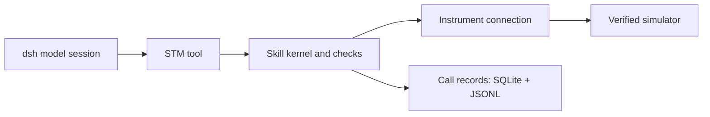

# dsh-spm

English | [简体中文](README.zh-CN.md)

**Scanning tunneling and scanning probe microscopy (STM/SPM) control as a TypeScript plugin for DeepSeek Harness.**

> **Status: active development · experimental.** The plugin is being developed and iterated. Current validation covers the specific simulator workflows documented below; APIs, configuration and supported tools may change. Real-instrument operation has not yet been validated. See the [remaining work](docs/MIGRATION-TODO.md) and [validation evidence](docs/REVIEW-GUIDE.md).

`dsh-spm` connects model tool calls to instrument operations with parameter checks, readback and persistent records. It migrates the scientific and instrument-control layer of MAST, a Python/LangGraph system, while dsh provides model orchestration, sessions, approvals and the application shell.

The engineering work spans binary protocols, stateful execution, numerical compatibility and test design. A running simulator path now connects an independently installed package to a native dsh model session and records what each tool actually did.

[Documentation](docs/README.md) · [Code and evidence](docs/REVIEW-GUIDE.md) · [STM-Bench runtime](docs/MINIMUM-USABLE.md) · [Nanonis simulator runtime](docs/NANONIS-SIMULATOR.md) · [Agent instructions](AGENTS.md)

## Why STM is difficult to automate

STM probes surfaces through the tunneling current between a sharp tip and a nearby sample. That current is approximately exponential in tip–sample distance: the sensitivity that enables atomic resolution also makes tiny disturbances consequential. Images reflect electronic structure as well as geometry; interpreting them requires a model of the measurement. See [Tersoff–Hamann theory](https://doi.org/10.1103/PhysRevB.31.805).

- **The tip state is only partly observable.** Images and spectra combine tip and sample responses, so they generally cannot uniquely identify the atomic configuration or electronic state of the tip apex.
- **The measurement conditions keep changing.** Thermal drift, piezoelectric creep and hysteresis complicate the relationship between commanded and actual position. Long measurements need repeated checks of spatial registration. See [research on scanner distortion](https://arxiv.org/abs/1611.00243).
- **Actions have a physical history.** Tip conditioning and manipulation can alter the tip or sample; restoring settings does not necessarily restore the previous physical state. Parameters that worked before a tip change may no longer work afterward, as demonstrated in [atom-manipulation experiments](https://doi.org/10.1038/s41467-022-35149-w).
- **Scientific judgment requires diagnosis.** A clear image alone does not establish trustworthy spectroscopy. Anomalies call for competing explanations, control measurements and a decision about whether to continue, recover or involve the operator.

These challenges motivate MAST and its successor: connect observations, constrained actions and evidence so that experimental decisions can be checked. `dsh-spm` contributes the instrument and domain layer to that goal; the simulator workflows below establish its current validation scope. For the broader scientific motivation, see [MAST-public's introduction](https://github.com/HamsterPark/MAST-public).

## From experimental constraints to execution checks

STM operations change instrument state. A successful command must be distinguished from a confirmed setting or scan state, and later actions depend on the state left behind. The plugin therefore combines model-facing contracts with execution checks, instrument readback and durable call records.

In the validated Nanonis workflow, the model reads state, sets a target bias, starts and stops scanning, and restores the bias. The acceptance check compares bias and scan state through an independent TCP connection and associates the model's tool events with local records. Instrument tools follow this execution path:



## What runs today

The following Windows acceptance records were produced on **2026-09-21**. Each row identifies its own package; rebuilding the same filename produces a new artifact to verify.

| Runtime | Model-visible tools | Recorded result |
|---|---|---|
| Managed STM-Bench | `stm_hello`, `GetBias` | Package `8c510e…` installed in two independent homes. Real model calls returned bias matching an independent TCP read, with persisted results. A separate dispatcher check recorded failure after simulator disconnection. [Evidence](docs/handoff/minimum-usable-20260921.md) |
| Already-running Nanonis Mimea + STM Simulator | Hello, bias/current/Z/scan-status reads, `SetBias`, `StartScan`, `StopScan` | Package `b5a7ab…` completed installation and a real model workflow: 7 requests, 9 tool calls, verified bias changes and scan start/stop, with session/SQLite/JSONL records linked by call ID. [Evidence](docs/handoff/native-nanonis-20260921.md) |

These are bounded simulator runtimes. The recorded Nanonis run covers Generic 5e / RT Release 15016; scan-state checks do not establish complete image acquisition. Full client integration, hardware validation, other platforms and public npm distribution remain outside this acceptance scope. MAST's earlier use on real instruments is project background; hardware validation of this plugin is deferred to Phase 8.

## Engineering decisions to inspect

- **Keep execution accountable.** A tool passes through the skill kernel to the instrument connection; measured results and instrument calls are associated with its call ID. Runtime shutdown waits for in-flight calls before closing records. Start with [runtime wiring](packages/bundle/dsh-spm/src/minimal.ts) and the [shutdown regression test](packages/bundle/dsh-spm/src/minimal-lifecycle.test.ts).
- **Migrate behavior against a reference.** Exported schemas, traces and numerical fixtures make cross-language differences testable. Numerical tolerances belong to the operation; intentional differences have reasons and reconsideration criteria in the [deviation register](spec/deviations.md).
- **Test the assertions themselves.** The [mutation runner](tools/mutate/run.ts) establishes a passing baseline, applies a compilable defect and checks that the declared test scope detects it. Surviving and inconclusive mutations remain visible.
- **State the limits of dependency analysis.** Composite workflows follow both direct calls and declared steps to compute transitive dependencies; unresolved dispatch is recorded explicitly. See the [dependency tests](packages/host/stm-skills/src/l0/tip-phase-deps.test.ts).
- **Isolate the upstream API.** Production code uses [compat](packages/host/compat/src/index.ts), backed by real-package contract tests and pinned dependencies. The minimum distribution packages internal workspace code and checks dependency identity after installation.

The [review guide](docs/REVIEW-GUIDE.md) connects these choices to specific implementations, tests and acceptance reports.

## Migration scope

A skill here is an executable operation with a parameter schema, preconditions and a result contract. The generated inventory currently marks **442 / 515 skills** and **112 / 165 modules** complete. Thirteen skills are intentionally excluded, leaving 60 in scope and reachable targets of 502 skills / 160 modules. See [progress.json](spec/progress.json) and the [remaining migration work](docs/MIGRATION-TODO.md).

`done` means a registered implementation, a generated specification, a reference model schema and at least one reference trace exist. It is a migration classification; the running profiles expose the explicit tool sets listed above. Full migration acceptance is defined in the [development guide](docs/DEVELOPMENT.md).

## Build and test

Use Node and pnpm as declared in [package.json](package.json). From the repository root:

```text
pnpm install --frozen-lockfile
pnpm build
pnpm test --project unit --project contract
```

These checks need no private MAST installation, model key or external simulator. The `integration` project additionally requires `STMSIM_PYTHON` / `STMSIM_ROOT`; it starts STM-Bench and is included when `pnpm test` is run without project selection.

For installation and model operation, choose the appropriate runtime guide above. STM-Bench is started and stopped by the plugin. The Nanonis path verifies an already-running Windows simulator and disconnects without closing it; its commands can change bias and scan state.

The [final candidate validation and publication boundary](docs/handoff/publication-ready-20260921.md) records the publication candidate and its checks. The [review guide](docs/REVIEW-GUIDE.md) also retains the earlier simulator acceptance and [historical CI failures](docs/RELEASE-TODO.md); these results refer to their own snapshots and artifact hashes.

## Repository map

| Path | Responsibility |
|---|---|
| `packages/host/kernel/` | Skill execution, units, parameter and safety checks |
| `packages/host/numerics/`, `vision/` | Numerical methods and image-analysis criteria |
| `packages/host/stm-skills/` | Tool adaptation, individual skills and composite workflows |
| `packages/host/stm-records/`, `stm-safety/`, `nanonis-files/`, `compat/` | Persistent records, safety service, file formats and dsh adaptation |
| `packages/instrument/` | TCP protocol, connections, state, watchdog and simulator process management |
| `packages/bundle/`, `scripts/` | Runtime composition, packaging, installation and acceptance tools |
| `packages/client/` | Dedicated client integration under development |
| `spec/`, `tools/spec-export/`, `tools/mutate/` | Reference evidence, deviations, progress, exporters and mutation drills |

## Working on the project

- [Documentation map](docs/README.md): choose a reading path for review, operation, development or project history.
- [AGENTS.md](AGENTS.md): task routing, boundaries and validation defaults for coding agents.
- [DEVELOPMENT.md](docs/DEVELOPMENT.md): migration acceptance, generation, tests and collaboration.
- [RELEASE-TODO.md](docs/RELEASE-TODO.md): publication preparation and recorded checks.
- [SOURCES.md](docs/SOURCES.md): provenance and third-party notices, including reference-derived fixtures and public-text normalization.

Licensed under [MIT](LICENSE). Third-party material retains the notices described in the source register.
