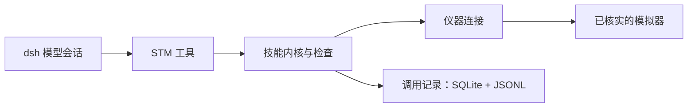

# dsh-spm

[English](README.md) · 中文

**面向扫描隧道显微镜与扫描探针显微镜（STM/SPM）的仪器控制，以 DeepSeek Harness 的 TypeScript 插件实现。**

> **状态：持续开发中的实验项目。** 插件仍在开发与迭代。当前验收仅覆盖下文列出的模拟器流程；接口、配置和开放工具仍可能变化。`dsh-spm` 尚未经过真实仪器验证。详见[剩余工作](docs/MIGRATION-TODO.md)与[验证证据](docs/REVIEW-GUIDE.md)。

`dsh-spm` 通过参数检查、仪器回读与持久化记录，将模型工具调用连接到仪器操作。它迁移 Python/LangGraph 系统 MAST 的科学计算与仪器控制层，由 dsh 提供模型编排、会话、审批和应用外壳。

工程工作涉及二进制协议、有状态执行、数值兼容性与测试设计。现有模拟器运行链路已能把独立安装的插件接入原生 dsh 模型会话，并记录每次工具调用实际执行的操作。

[文档导航](docs/README.md) · [代码与证据](docs/REVIEW-GUIDE.md) · [STM-Bench 运行指南](docs/MINIMUM-USABLE.md) · [Nanonis 模拟器运行指南](docs/NANONIS-SIMULATOR.md) · [智能体工作指引](AGENTS.md)

## 为什么 STM 实验难以自动化

STM 利用尖锐针尖与邻近样品之间的隧穿电流探测表面。电流随针尖—样品距离近似呈指数变化：实现原子分辨率的高灵敏度，也使微小扰动足以显著影响测量。图像同时包含几何形貌与电子结构信息，解释它需要理解测量过程。理论背景见 [Tersoff–Hamann 理论](https://doi.org/10.1103/PhysRevB.31.805)。

- **针尖状态只能间接判断。** 图像和谱线是针尖与样品共同作用的结果，通常无法据此唯一确定针尖末端的原子构型或电子态。
- **测量条件持续变化。** 热漂移、压电蠕变与迟滞使指令位置和实际位置的对应关系变得复杂，长时间测量需要反复核对是否仍在同一位置。参见[扫描器畸变研究](https://arxiv.org/abs/1611.00243)。
- **操作会留下物理历史。** 修针、操纵等动作可能改变针尖或样品，把参数调回去未必能恢复原先的物理状态。[原子操纵实验](https://doi.org/10.1038/s41467-022-35149-w)也表明，针尖变化前有效的参数，变化后可能失效。
- **科学判断依赖诊断。** 图像清晰本身不能证明后续谱学测量可信。发现异常后，需要提出不同解释、安排对照测量，再决定继续、恢复条件还是请操作者介入。

这些难点构成了 MAST 及其下一代项目的动机：把观测、受约束的行动与证据连起来，让实验决策有据可查。`dsh-spm` 为这一目标提供仪器与领域层能力，当前验证范围以下文的模拟器流程为准。更完整的科学背景见 [MAST-public 的介绍](https://github.com/HamsterPark/MAST-public/blob/main/README.zh.md)。

## 从实验约束到执行检查

STM 操作会改变仪器状态。命令成功返回，不等于目标设定或扫描状态已经得到确认；后续操作也依赖先前留下的状态。因此，插件将模型可见的工具契约与执行检查、仪器回读及持久化调用记录结合起来。

在已验收的 Nanonis 流程中，模型读取状态、设置目标偏压、启动和停止扫描，最后恢复偏压。验收程序通过独立 TCP 连接核对偏压与扫描状态，并把模型工具事件关联到本地记录。仪器工具遵循以下执行路径：



## 当前可运行范围

以下 Windows 验收记录形成于 **2026-09-21**。每行对应各自的安装包；即使重建后文件名相同，也须按新产物重新核验。

| 运行入口 | 模型可见工具 | 已记录结果 |
|---|---|---|
| 受管 STM-Bench | `stm_hello`、`GetBias` | 包 `8c510e…` 安装于两个独立 home。真实模型调用返回的偏压与独立 TCP 回读一致，并留有持久化结果。另一次调度器检查记录了模拟器断开后的失败状态。[验收记录](docs/handoff/minimum-usable-20260921.md) |
| 已打开的 Nanonis Mimea + STM Simulator | Hello、偏压/电流/Z/扫描状态读取，以及 `SetBias`、`StartScan`、`StopScan` | 包 `b5a7ab…` 完成安装及真实模型流程：7 次请求、9 次工具调用，偏压变化和扫描启停均得到核对；会话、SQLite 与 JSONL 记录通过调用 ID 关联。[验收记录](docs/handoff/native-nanonis-20260921.md) |

这些都是限定范围的模拟器运行验收。Nanonis 记录覆盖 Generic 5e / RT Release 15016；扫描状态检查不等于完整图像采集验收。完整客户端集成、真实仪器验证、其他平台和公开 npm 发布均不在上述验收范围。MAST 曾用于真实仪器属于项目背景；本插件的真实仪器验证留待 Phase 8。

## 值得查看的工程取舍

- **让执行可追溯。** 工具调用经技能内核到达仪器连接，测量结果和仪器调用都关联其调用 ID。关闭运行时会等待进行中的调用结束，再关闭记录。可从[运行时接线](packages/bundle/dsh-spm/src/minimal.ts)和[关闭流程回归测试](packages/bundle/dsh-spm/src/minimal-lifecycle.test.ts)看起。
- **依据参考行为迁移。** 导出的 schema、轨迹与数值夹具使跨语言差异可测试。容差由具体操作决定；有意保留的差异在[偏差登记](spec/deviations.md)中记录原因和重新考虑的判据。
- **测试断言本身。** [变异演练程序](tools/mutate/run.ts)先建立通过的基线，再注入可编译缺陷，检查所声明的测试范围能否检出。未检出与结论不确定的变异仍会保留在结果中。
- **说明依赖分析的边界。** 组合流程沿直接调用与显式声明的步骤计算传递依赖；无法解析的分发会明确记录。参见[依赖测试](packages/host/stm-skills/src/l0/tip-phase-deps.test.ts)。
- **隔离上游 API。** 生产代码经 [compat](packages/host/compat/src/index.ts) 适配 dsh，并以真实上游包的契约测试和精确锁定的依赖守住边界。最小发行包打包内部工作区代码，安装后检查依赖身份。

[代码评审指南](docs/REVIEW-GUIDE.md)将这些取舍对应到实现、测试和验收报告。

## 迁移范围

这里的技能是具备参数 schema、前置条件和结果契约的可执行操作。生成的迁移清单目前将 **442 / 515 项技能**、**112 / 165 个模块**标为完成。其中 13 项技能明确排除，尚有 60 项在范围内；可达目标为 502 项技能 / 160 个模块。详见 [progress.json](spec/progress.json) 和[剩余迁移工作](docs/MIGRATION-TODO.md)。

`done` 要求实现已注册、生成规格存在、参考模型 schema 存在，且至少有一条参考轨迹。这是迁移分类，不表示技能都已通过运行入口向模型开放；当前运行配置的工具集合以上表为准。完整迁移验收定义见[开发指南](docs/DEVELOPMENT.md)。

## 构建与测试

Node 和 pnpm 版本以 [package.json](package.json) 为准。在仓库根目录运行：

```text
pnpm install --frozen-lockfile
pnpm build
pnpm test --project unit --project contract
```

这些检查无需私有 MAST 安装、模型密钥或外部模拟器。`integration` 测试项目另需 `STMSIM_PYTHON` / `STMSIM_ROOT`，会启动 STM-Bench；不筛选项目直接运行 `pnpm test` 时也会包含它。

安装和模型操作请按上方对应运行指南执行。STM-Bench 由插件启动和关闭；Nanonis 路径会先核实已打开的 Windows 模拟器身份，结束时仅断开连接而不关闭该模拟器，其命令可能改变偏压和扫描状态。

[最终候选产物检查与公开发布边界](docs/handoff/publication-ready-20260921.md)记录了候选产物及其检查。[代码评审指南](docs/REVIEW-GUIDE.md)也保留了较早的模拟器验收和[历史 CI 失败](docs/RELEASE-TODO.md)；各项结果只对应其记录中的快照和包哈希。

## 仓库结构

| 路径 | 职责 |
|---|---|
| `packages/host/kernel/` | 技能执行、单位、参数与安全检查 |
| `packages/host/numerics/`、`vision/` | 数值方法与图像分析判据 |
| `packages/host/stm-skills/` | 工具适配、单项技能与组合流程 |
| `packages/host/stm-records/`、`stm-safety/`、`nanonis-files/`、`compat/` | 持久化记录、安全服务、文件格式及 dsh 适配 |
| `packages/instrument/` | TCP 协议、连接、状态、看门狗及模拟器进程管理 |
| `packages/bundle/`、`scripts/` | 运行时组合、打包、安装与验收工具 |
| `packages/client/` | 开发中的专用客户端集成 |
| `spec/`、`tools/spec-export/`、`tools/mutate/` | 参考证据、偏差、进度、导出程序与变异演练 |

## 参与开发

- [文档导航](docs/README.md)：按评审、运行、开发或项目历史选择阅读路径。
- [AGENTS.md](AGENTS.md)：面向编码智能体的任务入口、边界和默认验证要求。
- [DEVELOPMENT.md](docs/DEVELOPMENT.md)：迁移验收、生成、测试和协作流程。
- [RELEASE-TODO.md](docs/RELEASE-TODO.md)：公开发布准备与已记录检查。
- [SOURCES.md](docs/SOURCES.md)：来源和第三方声明，包括参考派生夹具与公开文本规范化。

本项目采用 [MIT 许可证](LICENSE)。第三方材料保留来源登记中说明的声明。
